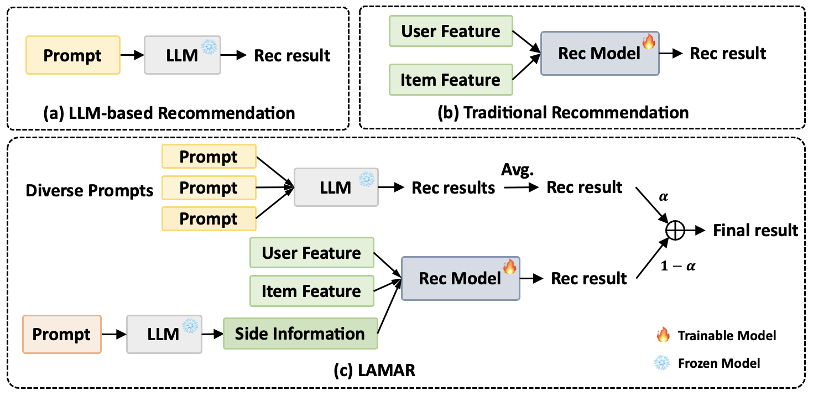

# Large Language Models Augmented Rating Prediction in Recommender System

This is the PyTorch implementation for LAMAR model.

> **Large Language Models Augmented Rating Prediction in Recommender System.**  
Sichun Luo, Jiansheng Wang, Aojun Zhou, Li Ma, Linqi Song.  
*ICASSP2024*

---

## Introduction
In this paper, we propose *L*arge l*A*nguage *M*odel *A*ugmented *R*ecommendation (**LAMAR**) framework to address this limitation. Instead of relying solely on LLMs, our framework combines their outputs with traditional recommendation models, leveraging both collaborative and semantic information. We further enhance the recommendation performance through an ensemble of diverse prompts and utilize LLMs to extract side information for augmenting traditional recommendation models.

